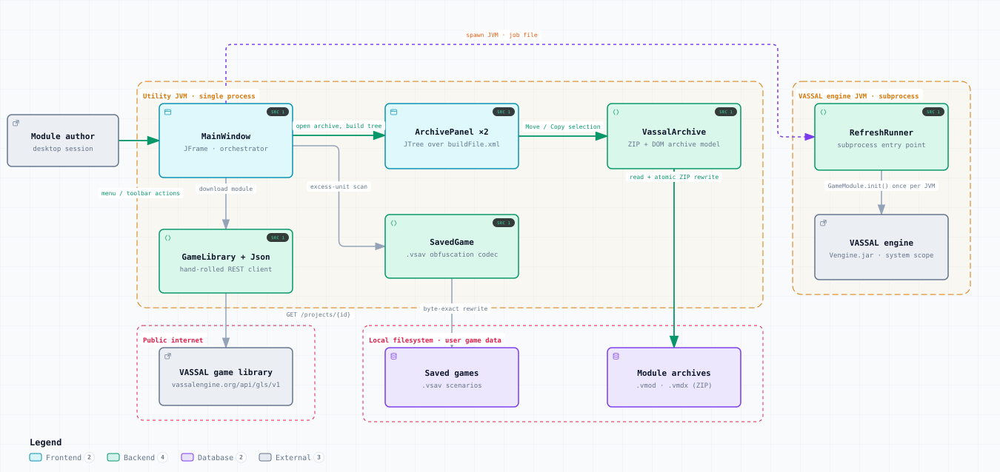

# VASSAL Extension Utility — Runtime Architecture

<picture>
  <source media="(prefers-color-scheme: dark)" srcset="architecture-dark.svg">
  
</picture>

*The image above is a static export. The interactive version — pan, zoom, search, relationship tracing and its own light/dark toggle — is [`architecture.html`](architecture.html); download it and open it in a browser, no server or network needed.*

## Boundaries

- **Utility JVM · single process** — MainWindow, GameLibrary + Json, ArchivePanel ×2, SavedGame, VassalArchive
- **VASSAL engine JVM · subprocess** — RefreshRunner, VASSAL engine
- **Local filesystem · user game data** — Saved games, Module archives
- **Public internet** — VASSAL game library

## Elements

| Element | Kind | Note |
|---|---|---|
| **Module author** | external | desktop session |
| **MainWindow** | frontend | JFrame · orchestrator |
| **VASSAL game library** | external | vassalengine.org/api/gls/v1 |
| **GameLibrary + Json** | backend | hand-rolled REST client |
| **ArchivePanel ×2** | frontend | JTree over buildFile.xml |
| **SavedGame** | backend | .vsav obfuscation codec |
| **VassalArchive** | backend | ZIP + DOM archive model |
| **RefreshRunner** | backend | subprocess entry point |
| **VASSAL engine** | external | Vengine.jar · system scope |
| **Saved games** | database | .vsav scenarios |
| **Module archives** | database | .vmod · .vmdx (ZIP) |

## Flows

| From | | To | Carries |
|---|---|---|---|
| Module author | → | MainWindow | menu / toolbar actions |
| MainWindow | → | ArchivePanel ×2 | open archive, build tree |
| ArchivePanel ×2 | → | VassalArchive | Move / Copy selection |
| VassalArchive | → | Module archives | read + atomic ZIP rewrite |
| MainWindow | → | GameLibrary + Json | download module |
| GameLibrary + Json | → | VASSAL game library | GET /projects/{id} |
| MainWindow | → | SavedGame | excess-unit scan |
| SavedGame | → | Saved games | byte-exact rewrite |
| MainWindow | → | RefreshRunner | spawn JVM · job file |
| RefreshRunner | → | VASSAL engine | GameModule.init() once per JVM |

## What it shows

### Trees and display

- ComponentNode reproduces VASSAL's editor label: configure name plus [Component Type]
- An extension panel rebuilds the module hierarchy it grafts into, as grey inherited nodes
- refresh() preserves expansion, selection and scroll across every DOM rebuild

### Archive edits

- Move / Copy deep-clones DOM subtrees with importNode, one ExtensionElement wrapper each
- Images and setup .vsav entries travel with the source entry's modification time
- Nothing reaches disk until Save; writeArchive() moves a temp file into place

### Saved games and refresh

- All three obfuscation formats are read and re-emitted in whichever one the file arrived in
- A piece counts as excess only when both its GPID and its name miss every active slot
- RefreshRunner backs up each .vsav, then PreservedState restores its extension list and maps

---

Source: [`architecture.spec.json`](architecture.spec.json) · rendered with the `archify` skill at its `showcase` quality profile. The SVGs beside this page are exported from that same HTML, so the three formats cannot drift — regenerate them together with [`docs/export-diagrams.py`](../export-diagrams.py); see [`docs/diagrams.md`](../diagrams.md).
