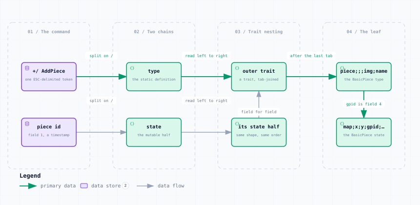

# A game piece in a saved game — Record Layout

<picture>
  <source media="(prefers-color-scheme: dark)" srcset="piece-record-dark.svg">
  
</picture>

*The image above is a static export. The interactive version — pan, zoom, search, relationship tracing and its own light/dark toggle — is [`piece-record.html`](piece-record.html); download it and open it in a browser, no server or network needed.*

**Stages:** The command → Two chains → Trait nesting → The leaf

## Elements

| Element | Kind | Note |
|---|---|---|
| **+/ AddPiece** | database | one ESC-delimited token |
| **piece id** | database | field 1, a timestamp |
| **type** | backend | the static definition |
| **state** | backend | the mutable half |
| **outer trait** | backend | a trait, tab-joined |
| **its state half** | backend | same shape, same order |
| **piece;;;img;name** | backend | the BasicPiece type |
| **map;x;y;gpid;…** | backend | the BasicPiece state |

## Flows

| From | | To | Carries |
|---|---|---|---|
| +/ AddPiece | → | type | split on /  |
| type | → | outer trait | read left to right |
| outer trait | → | piece;;;img;name | after the last tab |
| piece id | → | state | split on / |
| state | → | its state half | read left to right |
| its state half | → | outer trait | field for field |
| piece;;;img;name | → | map;x;y;gpid;… | gpid is field 4 |

## What it shows

### Two parallel chains, one shape

- type is GamePiece.getType() — what the piece is; state is getState() — where it is and how it looks
- Both are tab-joined trait chains in the same order, so trait n of one lines up with trait n of the other
- Prototypes are expanded inline, so a saved type can never be compared to a PieceSlot definition whole

### Reaching the leaf

- The innermost trait is the substring after the LAST tab — it carries no escaping
- Identity lives there: name is field 5 of the type, gpid field 4 of the state
- Field 5 of the state is a property count, followed by that many key;value pairs

---

Source: [`piece-record.dataflow.json`](piece-record.dataflow.json) · rendered with the `archify` skill at its `showcase` quality profile. The SVGs beside this page are exported from that same HTML, so the three formats cannot drift — regenerate them together with [`docs/export-diagrams.py`](../../export-diagrams.py); see [`docs/diagrams.md`](../../diagrams.md).
