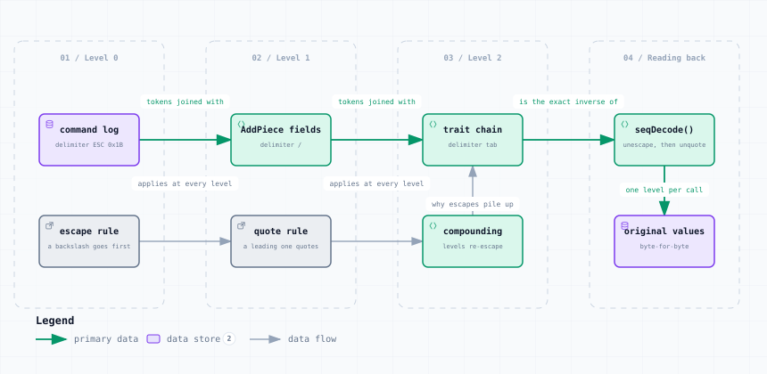

# SequenceEncoder — Nesting and Escaping

<picture>
  <source media="(prefers-color-scheme: dark)" srcset="sequence-encoder-dark.svg">
  
</picture>

*The image above is a static export. The interactive version — pan, zoom, search, relationship tracing and its own light/dark toggle — is [`sequence-encoder.html`](sequence-encoder.html); download it and open it in a browser, no server or network needed.*

**Stages:** Level 0 → Level 1 → Level 2 → Reading back

## Elements

| Element | Kind | Note |
|---|---|---|
| **command log** | database | delimiter ESC 0x1B |
| **escape rule** | external | a backslash goes first |
| **AddPiece fields** | backend | delimiter / |
| **quote rule** | external | a leading one quotes |
| **trait chain** | backend | delimiter tab |
| **compounding** | backend | levels re-escape |
| **seqDecode()** | backend | unescape, then unquote |
| **original values** | database | byte-for-byte |

## Flows

| From | | To | Carries |
|---|---|---|---|
| command log | → | AddPiece fields | tokens joined with |
| AddPiece fields | → | trait chain | tokens joined with |
| trait chain | → | seqDecode() | is the exact inverse of |
| escape rule | → | quote rule | applies at every level |
| quote rule | → | compounding | applies at every level |
| compounding | → | trait chain | why escapes pile up |
| seqDecode() | → | original values | one level per call |

## What it shows

### One encoder, three delimiters

- A literal delimiter inside a token is prefixed with a backslash
- A token that starts with a backslash, or is already quoted, is wrapped in single quotes
- Encoding {A, {B, C}} with delimiter , gives  A,B\,C

### Why escapes pile up

- Each nesting level escapes the backslashes the level below already wrote
- A real trait state reads  -1\t-1\\t-1\\\\t… — the run doubling at every level
- This is the O(traits squared) growth measured in the WiF save-bloat analysis

### Which is why tools copy verbatim

- Decoding and re-encoding an untouched token is not guaranteed to reproduce its bytes
- Every tool here edits the bytes it targets and copies the rest through unchanged

---

Source: [`sequence-encoder.dataflow.json`](sequence-encoder.dataflow.json) · rendered with the `archify` skill at its `showcase` quality profile. The SVGs beside this page are exported from that same HTML, so the three formats cannot drift — regenerate them together with [`docs/export-diagrams.py`](../../export-diagrams.py); see [`docs/diagrams.md`](../../diagrams.md).
