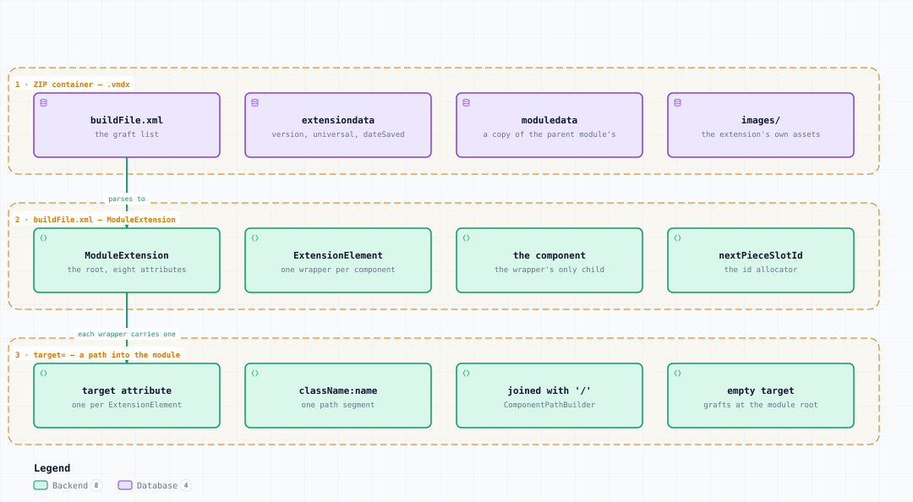

# .vmdx — Container Structure

<picture>
  <source media="(prefers-color-scheme: dark)" srcset="vmdx-structure-dark.svg">
  
</picture>

*The image above is a static export. The interactive version — pan, zoom, search, relationship tracing and its own light/dark toggle — is [`vmdx-structure.html`](vmdx-structure.html); download it and open it in a browser, no server or network needed.*

## Boundaries

- **1 · ZIP container — .vmdx** — buildFile.xml, extensiondata, moduledata, images/
- **2 · buildFile.xml — ModuleExtension** — ModuleExtension, ExtensionElement, the component, nextPieceSlotId
- **3 · target= — a path into the module** — target attribute, className:name, joined with '/', empty target

## Elements

| Element | Kind | Note |
|---|---|---|
| **buildFile.xml** | database | the graft list |
| **extensiondata** | database | version, universal, dateSaved |
| **moduledata** | database | a copy of the parent module's |
| **images/** | database | the extension's own assets |
| **ModuleExtension** | backend | the root, eight attributes |
| **ExtensionElement** | backend | one wrapper per component |
| **the component** | backend | the wrapper's only child |
| **nextPieceSlotId** | backend | the id allocator |
| **target attribute** | backend | one per ExtensionElement |
| **className:name** | backend | one path segment |
| **joined with '/'** | backend | ComponentPathBuilder |
| **empty target** | backend | grafts at the module root |

## Flows

| From | | To | Carries |
|---|---|---|---|
| buildFile.xml | → | ModuleExtension | parses to |
| ModuleExtension | → | target attribute | each wrapper carries one |

## What it shows

### An extension holds nothing directly

- Every component sits inside an ExtensionElement naming where it grafts
- One wrapper per component — build() reads only its first child
- A wrapper left empty crashes the module launch, not just the extension

### Identity

- extensionId is the last 3 characters of a UUID, generated once
- Slots created in an extension get ids of the form &lt;extensionId&gt;:&lt;n&gt;
- A slot copied in from elsewhere keeps its plain numeric id — the source of GPID clashes

---

Source: [`vmdx-structure.architecture.json`](vmdx-structure.architecture.json) · rendered with the `archify` skill at its `showcase` quality profile. The SVGs beside this page are exported from that same HTML, so the three formats cannot drift — regenerate them together with [`docs/export-diagrams.py`](../../export-diagrams.py); see [`docs/diagrams.md`](../../diagrams.md).
