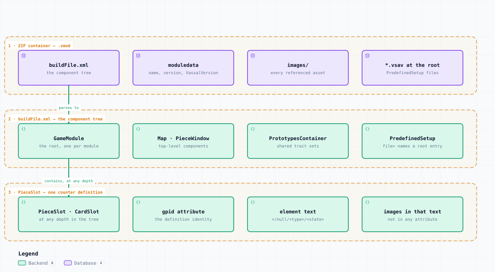

# .vmod — Container Structure

<picture>
  <source media="(prefers-color-scheme: dark)" srcset="vmod-structure-dark.svg">
  
</picture>

*The image above is a static export. The interactive version — pan, zoom, search, relationship tracing and its own light/dark toggle — is [`vmod-structure.html`](vmod-structure.html); download it and open it in a browser, no server or network needed.*

## Boundaries

- **1 · ZIP container — .vmod** — buildFile.xml, moduledata, images/, *.vsav at the root
- **2 · buildFile.xml — the component tree** — GameModule, Map · PieceWindow, PrototypesContainer, PredefinedSetup
- **3 · PieceSlot — one counter definition** — PieceSlot · CardSlot, gpid attribute, element text, images in that text

## Elements

| Element | Kind | Note |
|---|---|---|
| **buildFile.xml** | database | the component tree |
| **moduledata** | database | name, version, VassalVersion |
| **images/** | database | every referenced asset |
| ***.vsav at the root** | database | PredefinedSetup files |
| **GameModule** | backend | the root, one per module |
| **Map · PieceWindow** | backend | top-level components |
| **PrototypesContainer** | backend | shared trait sets |
| **PredefinedSetup** | backend | file= names a root entry |
| **PieceSlot · CardSlot** | backend | at any depth in the tree |
| **gpid attribute** | backend | the definition identity |
| **element text** | backend | +/null/&lt;type&gt;/&lt;state&gt; |
| **images in that text** | backend | not in any attribute |

## Flows

| From | | To | Carries |
|---|---|---|---|
| buildFile.xml | → | GameModule | parses to |
| GameModule | → | PieceSlot · CardSlot | contains, at any depth |

## What it shows

### The tree is the class hierarchy

- Every XML tag is a fully-qualified VASSAL class name
- The nesting mirrors the Java object tree built at run time
- A module must never contain a ModuleExtension.ExtensionElement

### Two things live outside the XML

- A piece definition is element text, so image names are found by scanning it
- A PredefinedSetup's file= is the literal name of a root-level ZIP entry
- Image entry mtimes are the tile cache key — never restamp them

---

Source: [`vmod-structure.architecture.json`](vmod-structure.architecture.json) · rendered with the `archify` skill at its `showcase` quality profile. The SVGs beside this page are exported from that same HTML, so the three formats cannot drift — regenerate them together with [`docs/export-diagrams.py`](../../export-diagrams.py); see [`docs/diagrams.md`](../../diagrams.md).
