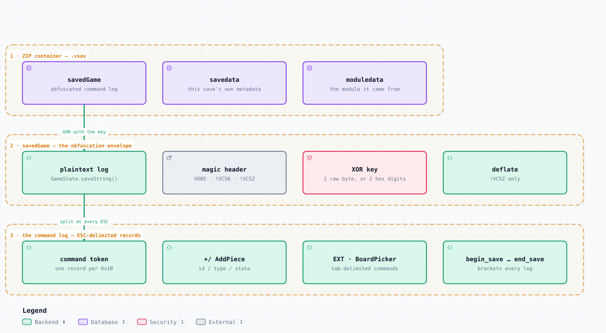

# .vsav — Container Structure

<picture>
  <source media="(prefers-color-scheme: dark)" srcset="vsav-structure-dark.svg">
  
</picture>

*The image above is a static export. The interactive version — pan, zoom, search, relationship tracing and its own light/dark toggle — is [`vsav-structure.html`](vsav-structure.html); download it and open it in a browser, no server or network needed.*

## Boundaries

- **1 · ZIP container — .vsav** — savedGame, savedata, moduledata
- **2 · savedGame — the obfuscation envelope** — plaintext log, magic header, XOR key, deflate
- **3 · the command log — ESC-delimited records** — command token, +/ AddPiece, EXT · BoardPicker, begin_save … end_save

## Elements

| Element | Kind | Note |
|---|---|---|
| **savedGame** | database | obfuscated command log |
| **savedata** | database | this save's own metadata |
| **moduledata** | database | the module it came from |
| **plaintext log** | backend | GameState.saveString() |
| **magic header** | external | VOBS · !VCSK · !VCSZ |
| **XOR key** | security | 1 raw byte, or 2 hex digits |
| **deflate** | backend | !VCSZ only |
| **command token** | backend | one record per 0x1B |
| **+/ AddPiece** | backend | id / type / state |
| **EXT · BoardPicker** | backend | tab-delimited commands |
| **begin_save … end_save** | backend | brackets every log |

## Flows

| From | | To | Carries |
|---|---|---|---|
| savedGame | → | plaintext log | XOR with the key |
| plaintext log | → | command token | split at every ESC |

## What it shows

### Three levels, three delimiters

- The ZIP layer is ordinary: three stored entries, no nesting
- The envelope is a header, a key and the plaintext XOR-ed with it
- The log is one long line; its record boundaries are 0x1B bytes, not newlines

### Why the format is preserved

- VOBS (3.8+) XORs raw so the ZIP deflate can still compress it
- !VCSK (through 3.7.x) hex-encodes, doubling the payload into 16 symbols
- !VCSZ deflates before the hex — a pre-release form that never shipped but is still read

---

Source: [`vsav-structure.architecture.json`](vsav-structure.architecture.json) · rendered with the `archify` skill at its `showcase` quality profile. The SVGs beside this page are exported from that same HTML, so the three formats cannot drift — regenerate them together with [`docs/export-diagrams.py`](../../export-diagrams.py); see [`docs/diagrams.md`](../../diagrams.md).
