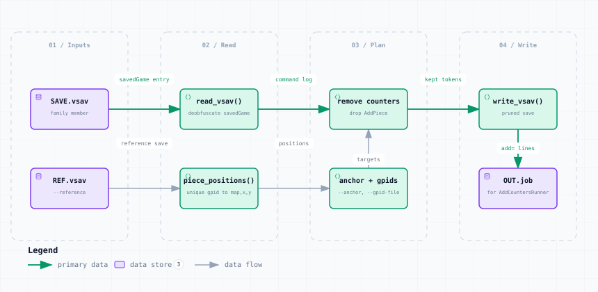

# copy_counter_positions.py — Data Flow

<picture>
  <source media="(prefers-color-scheme: dark)" srcset="copy_counter_positions-dark.svg">
  
</picture>

*The image above is a static export. The interactive version — pan, zoom, search, relationship tracing and its own light/dark toggle — is [`copy_counter_positions.html`](copy_counter_positions.html); download it and open it in a browser, no server or network needed.*

**Stages:** Inputs → Read → Plan → Write

## Elements

| Element | Kind | Note |
|---|---|---|
| **SAVE.vsav** | database | family member |
| **REF.vsav** | database | --reference |
| **read_vsav()** | backend | deobfuscate savedGame |
| **piece_positions()** | backend | unique gpid to map,x,y |
| **remove counters** | backend | drop AddPiece |
| **anchor + gpids** | backend | --anchor, --gpid-file |
| **write_vsav()** | backend | pruned save |
| **OUT.job** | database | for AddCountersRunner |

## Flows

| From | | To | Carries |
|---|---|---|---|
| SAVE.vsav | → | read_vsav() | savedGame entry |
| read_vsav() | → | remove counters | command log |
| remove counters | → | write_vsav() | kept tokens |
| REF.vsav | → | piece_positions() | reference save |
| piece_positions() | → | anchor + gpids | positions |
| anchor + gpids | → | remove counters | targets |
| write_vsav() | → | OUT.job | add= lines |

## What it shows

### Two steps, because stacking belongs to the engine

- Position is three state fields, but stacking is a separate piece listing members by id
- So each counter is removed here and re-placed by VASSAL at the reference position
- Map.placeOrMerge then merges it into whatever stack is there — as a drag would

### Running the job files

- The .job files are fed to refresh/AddCountersRunner, not to VASSAL directly
- A dangling id left in an old stack is harmless: setState() skips what it cannot resolve

---

Source: [`copy_counter_positions.dataflow.json`](copy_counter_positions.dataflow.json) · rendered with the `archify` skill at its `showcase` quality profile. The SVGs beside this page are exported from that same HTML, so the three formats cannot drift — regenerate them together with [`docs/export-diagrams.py`](../../export-diagrams.py); see [`docs/diagrams.md`](../../diagrams.md).
