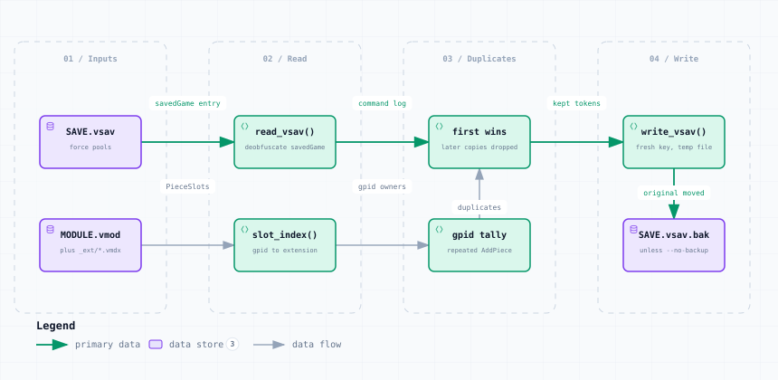

# dedupe_pieces.py — Data Flow

<picture>
  <source media="(prefers-color-scheme: dark)" srcset="dedupe_pieces-dark.svg">
  
</picture>

*The image above is a static export. The interactive version — pan, zoom, search, relationship tracing and its own light/dark toggle — is [`dedupe_pieces.html`](dedupe_pieces.html); download it and open it in a browser, no server or network needed.*

**Stages:** Inputs → Read → Duplicates → Write

## Elements

| Element | Kind | Note |
|---|---|---|
| **SAVE.vsav** | database | force pools |
| **MODULE.vmod** | database | plus _ext/*.vmdx |
| **read_vsav()** | backend | deobfuscate savedGame |
| **slot_index()** | backend | gpid to extension |
| **first wins** | backend | later copies dropped |
| **gpid tally** | backend | repeated AddPiece |
| **write_vsav()** | backend | fresh key, temp file |
| **SAVE.vsav.bak** | database | unless --no-backup |

## Flows

| From | | To | Carries |
|---|---|---|---|
| SAVE.vsav | → | read_vsav() | savedGame entry |
| read_vsav() | → | first wins | command log |
| first wins | → | write_vsav() | kept tokens |
| MODULE.vmod | → | slot_index() | PieceSlots |
| slot_index() | → | gpid tally | gpid owners |
| gpid tally | → | first wins | duplicates |
| write_vsav() | → | SAVE.vsav.bak | original moved |

## What it shows

### Always restrict it

- --extension is required: only counters of the named extensions are considered
- US Entry Option appears 17 times legitimately — blind deduplication destroys it
- --only-gpid names counters exactly, which is what a checked list calls for

### First, look

- Pass --list to see what is duplicated before selecting anything
- A duplicate is two AddPiece commands whose innermost state carries the same GPID

---

Source: [`dedupe_pieces.dataflow.json`](dedupe_pieces.dataflow.json) · rendered with the `archify` skill at its `showcase` quality profile. The SVGs beside this page are exported from that same HTML, so the three formats cannot drift — regenerate them together with [`docs/export-diagrams.py`](../../export-diagrams.py); see [`docs/diagrams.md`](../../diagrams.md).
