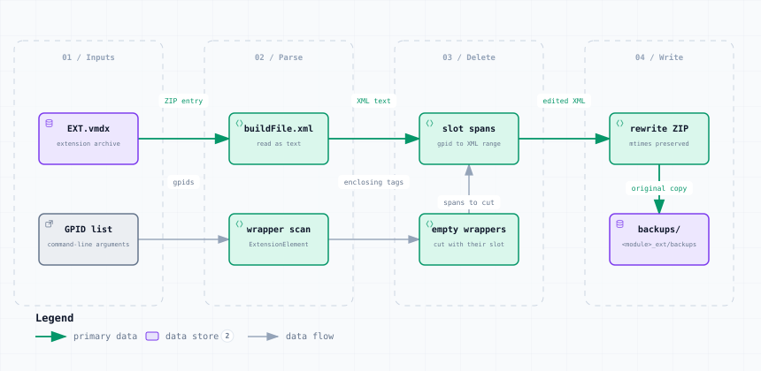

# drop_slots.py — Data Flow

<picture>
  <source media="(prefers-color-scheme: dark)" srcset="drop_slots-dark.svg">
  
</picture>

*The image above is a static export. The interactive version — pan, zoom, search, relationship tracing and its own light/dark toggle — is [`drop_slots.html`](drop_slots.html); download it and open it in a browser, no server or network needed.*

**Stages:** Inputs → Parse → Delete → Write

## Elements

| Element | Kind | Note |
|---|---|---|
| **EXT.vmdx** | database | extension archive |
| **GPID list** | external | command-line arguments |
| **buildFile.xml** | backend | read as text |
| **wrapper scan** | backend | ExtensionElement |
| **slot spans** | backend | gpid to XML range |
| **empty wrappers** | backend | cut with their slot |
| **rewrite ZIP** | backend | mtimes preserved |
| **backups/** | database | &lt;module&gt;_ext/backups |

## Flows

| From | | To | Carries |
|---|---|---|---|
| EXT.vmdx | → | buildFile.xml | ZIP entry |
| buildFile.xml | → | slot spans | XML text |
| slot spans | → | rewrite ZIP | edited XML |
| GPID list | → | wrapper scan | gpids |
| wrapper scan | → | empty wrappers | enclosing tags |
| empty wrappers | → | slot spans | spans to cut |
| rewrite ZIP | → | backups/ | original copy |

## What it shows

### The empty-wrapper trap

- A wrapper left with no component makes VASSAL abort the whole module launch
- ExtensionElement.build() leaves extension null and addTo() then dereferences it
- So a wrapper emptied by a deletion is removed along with the slot

### What is preserved

- Only buildFile.xml is rewritten, plus extensiondata when --version bumps it
- Every other entry keeps its original modification time, so image tiles stay fresh

---

Source: [`drop_slots.dataflow.json`](drop_slots.dataflow.json) · rendered with the `archify` skill at its `showcase` quality profile. The SVGs beside this page are exported from that same HTML, so the three formats cannot drift — regenerate them together with [`docs/export-diagrams.py`](../../export-diagrams.py); see [`docs/diagrams.md`](../../diagrams.md).
