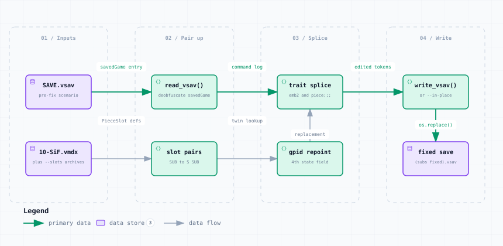

# fix_sif_subs.py — Data Flow

<picture>
  <source media="(prefers-color-scheme: dark)" srcset="fix_sif_subs-dark.svg">
  
</picture>

*The image above is a static export. The interactive version — pan, zoom, search, relationship tracing and its own light/dark toggle — is [`fix_sif_subs.html`](fix_sif_subs.html); download it and open it in a browser, no server or network needed.*

**Stages:** Inputs → Pair up → Splice → Write

## Elements

| Element | Kind | Note |
|---|---|---|
| **SAVE.vsav** | database | pre-fix scenario |
| **10-SiF.vmdx** | database | plus --slots archives |
| **read_vsav()** | backend | deobfuscate savedGame |
| **slot pairs** | backend | SUB to S SUB |
| **trait splice** | backend | emb2 and piece;;; |
| **gpid repoint** | backend | 4th state field |
| **write_vsav()** | backend | or --in-place |
| **fixed save** | database | (subs fixed).vsav |

## Flows

| From | | To | Carries |
|---|---|---|---|
| SAVE.vsav | → | read_vsav() | savedGame entry |
| read_vsav() | → | trait splice | command log |
| trait splice | → | write_vsav() | edited tokens |
| 10-SiF.vmdx | → | slot pairs | PieceSlot defs |
| slot pairs | → | gpid repoint | twin lookup |
| gpid repoint | → | trait splice | replacement |
| write_vsav() | → | fixed save | os.replace() |

## What it shows

### Why splice, not rebuild

- A saved piece type is the expanded trait list, so it never equals a PieceSlot definition
- The two slots of a pair differ in exactly two traits, both free of / and tab
- Those substrings appear verbatim at any nesting depth, so they can be spliced

### Keeping the original

- --add keeps the mis-named piece and places its twin beside it
- Piece id, map, position, layer and properties are copied verbatim

---

Source: [`fix_sif_subs.dataflow.json`](fix_sif_subs.dataflow.json) · rendered with the `archify` skill at its `showcase` quality profile. The SVGs beside this page are exported from that same HTML, so the three formats cannot drift — regenerate them together with [`docs/export-diagrams.py`](../../export-diagrams.py); see [`docs/diagrams.md`](../../diagrams.md).
