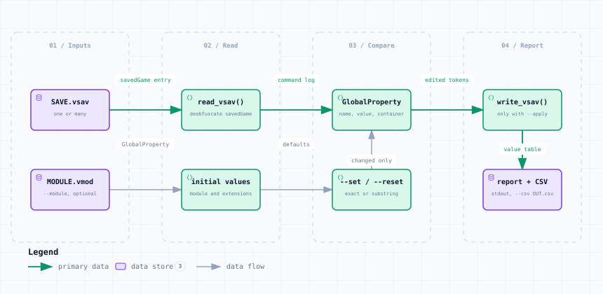

# global_properties.py — Data Flow

<picture>
  <source media="(prefers-color-scheme: dark)" srcset="global_properties-dark.svg">
  
</picture>

*The image above is a static export. The interactive version — pan, zoom, search, relationship tracing and its own light/dark toggle — is [`global_properties.html`](global_properties.html); download it and open it in a browser, no server or network needed.*

**Stages:** Inputs → Read → Compare → Report

## Elements

| Element | Kind | Note |
|---|---|---|
| **SAVE.vsav** | database | one or many |
| **MODULE.vmod** | database | --module, optional |
| **read_vsav()** | backend | deobfuscate savedGame |
| **initial values** | backend | module and extensions |
| **GlobalProperty** | backend | name, value, container |
| **--set / --reset** | backend | exact or substring |
| **write_vsav()** | backend | only with --apply |
| **report + CSV** | database | stdout, --csv OUT.csv |

## Flows

| From | | To | Carries |
|---|---|---|---|
| SAVE.vsav | → | read_vsav() | savedGame entry |
| read_vsav() | → | GlobalProperty | command log |
| GlobalProperty | → | write_vsav() | edited tokens |
| MODULE.vmod | → | initial values | GlobalProperty |
| initial values | → | --set / --reset | defaults |
| --set / --reset | → | GlobalProperty | changed only |
| write_vsav() | → | report + CSV | value table |

## What it shows

### The blind spot this fills

- Properties are game state but belong to no piece, so every other tool is silent on them
- Refresh Counters rebuilds pieces, never properties
- The symptom is a chart showing a number no counter on the table accounts for

### Finding the stale one

- --module plus --changed lists only properties that differ from their initialValue
- --reset=SUBSTR puts every matching property back to the module default

---

Source: [`global_properties.dataflow.json`](global_properties.dataflow.json) · rendered with the `archify` skill at its `showcase` quality profile. The SVGs beside this page are exported from that same HTML, so the three formats cannot drift — regenerate them together with [`docs/export-diagrams.py`](../../export-diagrams.py); see [`docs/diagrams.md`](../../diagrams.md).
