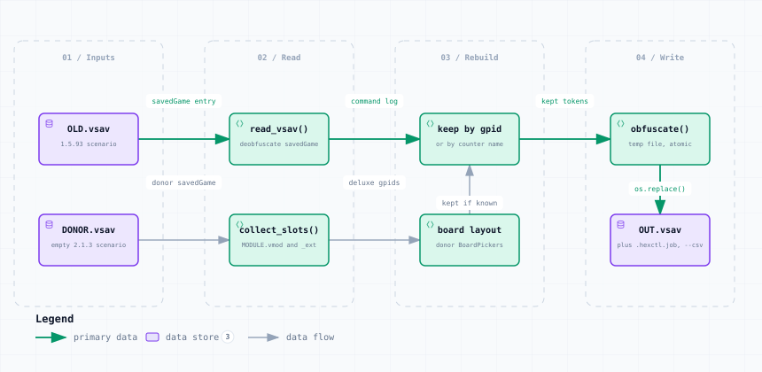

# migrate_15_to_21.py — Data Flow

<picture>
  <source media="(prefers-color-scheme: dark)" srcset="migrate_15_to_21-dark.svg">
  
</picture>

*The image above is a static export. The interactive version — pan, zoom, search, relationship tracing and its own light/dark toggle — is [`migrate_15_to_21.html`](migrate_15_to_21.html); download it and open it in a browser, no server or network needed.*

**Stages:** Inputs → Read → Rebuild → Write

## Elements

| Element | Kind | Note |
|---|---|---|
| **OLD.vsav** | database | 1.5.93 scenario |
| **DONOR.vsav** | database | empty 2.1.3 scenario |
| **read_vsav()** | backend | deobfuscate savedGame |
| **collect_slots()** | backend | MODULE.vmod and _ext |
| **keep by gpid** | backend | or by counter name |
| **board layout** | backend | donor BoardPickers |
| **obfuscate()** | backend | temp file, atomic |
| **OUT.vsav** | database | plus .hexctl.job, --csv |

## Flows

| From | | To | Carries |
|---|---|---|---|
| OLD.vsav | → | read_vsav() | savedGame entry |
| read_vsav() | → | keep by gpid | command log |
| keep by gpid | → | obfuscate() | kept tokens |
| DONOR.vsav | → | collect_slots() | donor savedGame |
| collect_slots() | → | board layout | deluxe gpids |
| board layout | → | keep by gpid | kept if known |
| obfuscate() | → | OUT.vsav | os.replace() |

## What it shows

### Why matching works at all

- GPIDs were preserved between 1.5.93 and 2.1.3 — 5225 of 6955 pieces match by GPID and name
- A piece is kept when its GPID or its name exists in the deluxe set
- A later Refresh Counters rebuilds every kept piece from the 2.1.3 definitions

### The donor supplies the table

- Every BoardPicker command and the moduledata entry come from the donor
- The donor World Maps layout doubles ASIA Main Insert; this writes PACIFIC Main Insert there
- Refuses to overwrite an existing OUT.vsav

---

Source: [`migrate_15_to_21.dataflow.json`](migrate_15_to_21.dataflow.json) · rendered with the `archify` skill at its `showcase` quality profile. The SVGs beside this page are exported from that same HTML, so the three formats cannot drift — regenerate them together with [`docs/export-diagrams.py`](../../export-diagrams.py); see [`docs/diagrams.md`](../../diagrams.md).
