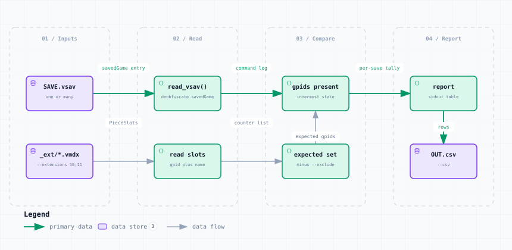

# missing_counters.py — Data Flow

<picture>
  <source media="(prefers-color-scheme: dark)" srcset="missing_counters-dark.svg">
  
</picture>

*The image above is a static export. The interactive version — pan, zoom, search, relationship tracing and its own light/dark toggle — is [`missing_counters.html`](missing_counters.html); download it and open it in a browser, no server or network needed.*

**Stages:** Inputs → Read → Compare → Report

## Elements

| Element | Kind | Note |
|---|---|---|
| **SAVE.vsav** | database | one or many |
| **_ext/*.vmdx** | database | --extensions 10,11 |
| **read_vsav()** | backend | deobfuscate savedGame |
| **read slots** | backend | gpid plus name |
| **gpids present** | backend | innermost state |
| **expected set** | backend | minus --exclude |
| **report** | backend | stdout table |
| **OUT.csv** | database | --csv |

## Flows

| From | | To | Carries |
|---|---|---|---|
| SAVE.vsav | → | read_vsav() | savedGame entry |
| read_vsav() | → | gpids present | command log |
| gpids present | → | report | per-save tally |
| _ext/*.vmdx | → | read slots | PieceSlots |
| read slots | → | expected set | counter list |
| expected set | → | gpids present | expected gpids |
| report | → | OUT.csv | rows |

## What it shows

### Three verdicts, not two

- missing — no copy of that GPID anywhere in the save
- off-map-only — every copy has map = null, so it cannot be reached or refreshed
- found-elsewhere — another piece carries the same name under a different GPID

### Read-only

- Nothing is written to any save; the report goes to stdout or --csv
- Presence is not restricted to a map: pools, decks and stacks all count

---

Source: [`missing_counters.dataflow.json`](missing_counters.dataflow.json) · rendered with the `archify` skill at its `showcase` quality profile. The SVGs beside this page are exported from that same HTML, so the three formats cannot drift — regenerate them together with [`docs/export-diagrams.py`](../../export-diagrams.py); see [`docs/diagrams.md`](../../diagrams.md).
