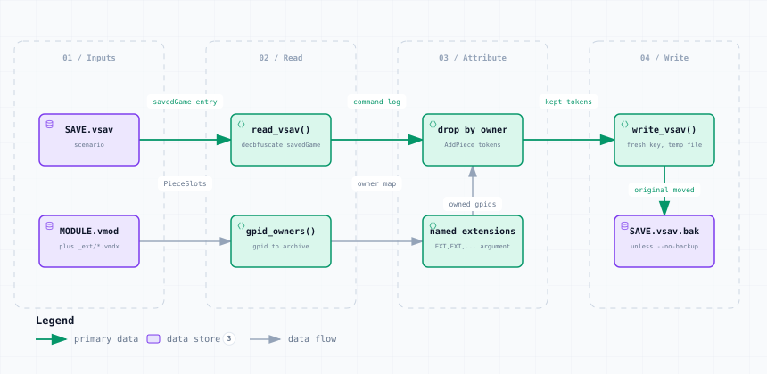

# remove_ext_counters.py — Data Flow

<picture>
  <source media="(prefers-color-scheme: dark)" srcset="remove_ext_counters-dark.svg">
  
</picture>

*The image above is a static export. The interactive version — pan, zoom, search, relationship tracing and its own light/dark toggle — is [`remove_ext_counters.html`](remove_ext_counters.html); download it and open it in a browser, no server or network needed.*

**Stages:** Inputs → Read → Attribute → Write

## Elements

| Element | Kind | Note |
|---|---|---|
| **SAVE.vsav** | database | scenario |
| **MODULE.vmod** | database | plus _ext/*.vmdx |
| **read_vsav()** | backend | deobfuscate savedGame |
| **gpid_owners()** | backend | gpid to archive |
| **drop by owner** | backend | AddPiece tokens |
| **named extensions** | backend | EXT,EXT,... argument |
| **write_vsav()** | backend | fresh key, temp file |
| **SAVE.vsav.bak** | database | unless --no-backup |

## Flows

| From | | To | Carries |
|---|---|---|---|
| SAVE.vsav | → | read_vsav() | savedGame entry |
| read_vsav() | → | drop by owner | command log |
| drop by owner | → | write_vsav() | kept tokens |
| MODULE.vmod | → | gpid_owners() | PieceSlots |
| gpid_owners() | → | named extensions | owner map |
| named extensions | → | drop by owner | owned gpids |
| write_vsav() | → | SAVE.vsav.bak | original moved |

## What it shows

### Not an Excess-Units case

- These pieces match their definitions perfectly, so Refresh Counters leaves them
- They simply belong to an extension the scenario was never meant to list
- Attribution is by GPID, which is exact once GPIDs are unique — check renumber_gpids.py first

### Dropping the listing too

- --drop-listing also removes the EXT command naming the extension
- Stacks are left alone: dangling member ids are skipped on load

---

Source: [`remove_ext_counters.dataflow.json`](remove_ext_counters.dataflow.json) · rendered with the `archify` skill at its `showcase` quality profile. The SVGs beside this page are exported from that same HTML, so the three formats cannot drift — regenerate them together with [`docs/export-diagrams.py`](../../export-diagrams.py); see [`docs/diagrams.md`](../../diagrams.md).
