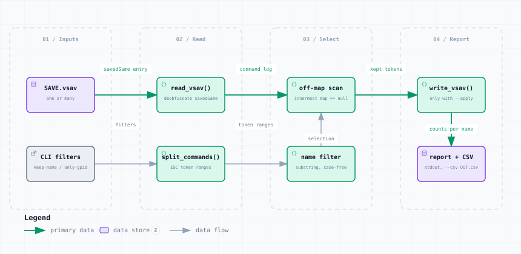

# remove_offmap_pieces.py — Data Flow

<picture>
  <source media="(prefers-color-scheme: dark)" srcset="remove_offmap_pieces-dark.svg">
  
</picture>

*The image above is a static export. The interactive version — pan, zoom, search, relationship tracing and its own light/dark toggle — is [`remove_offmap_pieces.html`](remove_offmap_pieces.html); download it and open it in a browser, no server or network needed.*

**Stages:** Inputs → Read → Select → Report

## Elements

| Element | Kind | Note |
|---|---|---|
| **SAVE.vsav** | database | one or many |
| **CLI filters** | external | keep-name / only-gpid |
| **read_vsav()** | backend | deobfuscate savedGame |
| **split_commands()** | backend | ESC token ranges |
| **off-map scan** | backend | innermost map == null |
| **name filter** | backend | substring, case-free |
| **write_vsav()** | backend | only with --apply |
| **report + CSV** | database | stdout, --csv OUT.csv |

## Flows

| From | | To | Carries |
|---|---|---|---|
| SAVE.vsav | → | read_vsav() | savedGame entry |
| read_vsav() | → | off-map scan | command log |
| off-map scan | → | write_vsav() | kept tokens |
| CLI filters | → | split_commands() | filters |
| split_commands() | → | name filter | token ranges |
| name filter | → | off-map scan | selection |
| write_vsav() | → | report + CSV | counts per name |

## What it shows

### Read the report first

- Off-map does not mean unwanted: ~529 ownership markers per WiF save look deliberate
- That is why it reports by default and writes only with --apply
- Use --keep-name to decide per counter name, not per save

### Why they persist

- An off-map piece is never collected by GameRefresher, so refresh cannot clear it
- Decks are never affected — their contents always carry a real map id

---

Source: [`remove_offmap_pieces.dataflow.json`](remove_offmap_pieces.dataflow.json) · rendered with the `archify` skill at its `showcase` quality profile. The SVGs beside this page are exported from that same HTML, so the three formats cannot drift — regenerate them together with [`docs/export-diagrams.py`](../../export-diagrams.py); see [`docs/diagrams.md`](../../diagrams.md).
