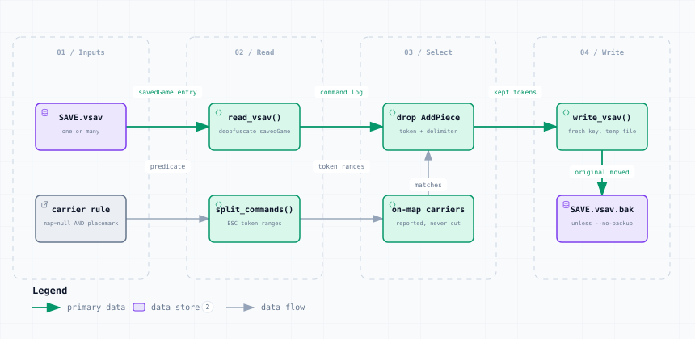

# remove_placemark_carriers.py — Data Flow

<picture>
  <source media="(prefers-color-scheme: dark)" srcset="remove_placemark_carriers-dark.svg">
  
</picture>

*The image above is a static export. The interactive version — pan, zoom, search, relationship tracing and its own light/dark toggle — is [`remove_placemark_carriers.html`](remove_placemark_carriers.html); download it and open it in a browser, no server or network needed.*

**Stages:** Inputs → Read → Select → Write

## Elements

| Element | Kind | Note |
|---|---|---|
| **SAVE.vsav** | database | one or many |
| **carrier rule** | external | map=null AND placemark |
| **read_vsav()** | backend | deobfuscate savedGame |
| **split_commands()** | backend | ESC token ranges |
| **drop AddPiece** | backend | token + delimiter |
| **on-map carriers** | backend | reported, never cut |
| **write_vsav()** | backend | fresh key, temp file |
| **SAVE.vsav.bak** | database | unless --no-backup |

## Flows

| From | | To | Carries |
|---|---|---|---|
| SAVE.vsav | → | read_vsav() | savedGame entry |
| read_vsav() | → | drop AddPiece | command log |
| drop AddPiece | → | write_vsav() | kept tokens |
| carrier rule | → | split_commands() | predicate |
| split_commands() | → | on-map carriers | token ranges |
| on-map carriers | → | drop AddPiece | matches |
| write_vsav() | → | SAVE.vsav.bak | original moved |

## What it shows

### Why not Refresh Counters

- Every carrier has map = null, and getRefreshables() walks map contents only
- So the engine never collects them, never rebuilds them, never warns
- Each carrier type is about 21 KB of stale embedded Place Marker

### Left alone

- A carrier that is on a map is reported and kept — refresh it instead
- Stacks keep dangling member ids; Stack.setState() skips what it cannot resolve

---

Source: [`remove_placemark_carriers.dataflow.json`](remove_placemark_carriers.dataflow.json) · rendered with the `archify` skill at its `showcase` quality profile. The SVGs beside this page are exported from that same HTML, so the three formats cannot drift — regenerate them together with [`docs/export-diagrams.py`](../../export-diagrams.py); see [`docs/diagrams.md`](../../diagrams.md).
