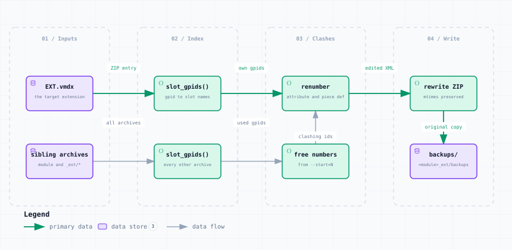

# renumber_gpids.py — Data Flow

<picture>
  <source media="(prefers-color-scheme: dark)" srcset="renumber_gpids-dark.svg">
  
</picture>

*The image above is a static export. The interactive version — pan, zoom, search, relationship tracing and its own light/dark toggle — is [`renumber_gpids.html`](renumber_gpids.html); download it and open it in a browser, no server or network needed.*

**Stages:** Inputs → Index → Clashes → Write

## Elements

| Element | Kind | Note |
|---|---|---|
| **EXT.vmdx** | database | the target extension |
| **sibling archives** | database | module and _ext/* |
| **slot_gpids()** | backend | gpid to slot names |
| **slot_gpids()** | backend | every other archive |
| **renumber** | backend | attribute and piece def |
| **free numbers** | backend | from --start=N |
| **rewrite ZIP** | backend | mtimes preserved |
| **backups/** | database | &lt;module&gt;_ext/backups |

## Flows

| From | | To | Carries |
|---|---|---|---|
| EXT.vmdx | → | slot_gpids() | ZIP entry |
| slot_gpids() | → | renumber | own gpids |
| renumber | → | rewrite ZIP | edited XML |
| sibling archives | → | slot_gpids() | all archives |
| slot_gpids() | → | free numbers | used gpids |
| free numbers | → | renumber | clashing ids |
| rewrite ZIP | → | backups/ | original copy |

## What it shows

### The misleading error this fixes

- VASSAL says "module was saved with older vassal version" and refuses to refresh
- GpIdChecker.testGpId() actually flags an empty, non-numeric or duplicate GPID
- It never looks at the VASSAL version at all

### Never leave a spare copy in _ext/

- ExtensionsManager loads every non-hidden file whose metadata parses as an extension
- A foo.vmdx.bak sitting there re-creates every duplicate just removed
- Backups therefore go in &lt;module&gt;_ext/backups/, which is a directory and so skipped

---

Source: [`renumber_gpids.dataflow.json`](renumber_gpids.dataflow.json) · rendered with the `archify` skill at its `showcase` quality profile. The SVGs beside this page are exported from that same HTML, so the three formats cannot drift — regenerate them together with [`docs/export-diagrams.py`](../../export-diagrams.py); see [`docs/diagrams.md`](../../diagrams.md).
