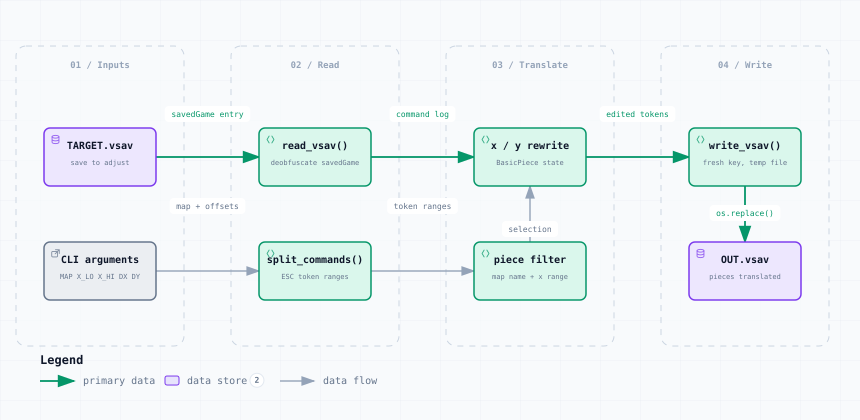

# shift_pieces.py — Data Flow

<picture>
  <source media="(prefers-color-scheme: dark)" srcset="shift_pieces-dark.svg">
  
</picture>

*The image above is a static export. The interactive version — pan, zoom, search, relationship tracing and its own light/dark toggle — is [`shift_pieces.html`](shift_pieces.html); download it and open it in a browser, no server or network needed.*

**Stages:** Inputs → Read → Translate → Write

## Elements

| Element | Kind | Note |
|---|---|---|
| **TARGET.vsav** | database | save to adjust |
| **CLI arguments** | external | MAP X_LO X_HI DX DY |
| **read_vsav()** | backend | deobfuscate savedGame |
| **split_commands()** | backend | ESC token ranges |
| **x / y rewrite** | backend | BasicPiece state |
| **piece filter** | backend | map name + x range |
| **write_vsav()** | backend | fresh key, temp file |
| **OUT.vsav** | database | pieces translated |

## Flows

| From | | To | Carries |
|---|---|---|---|
| TARGET.vsav | → | read_vsav() | savedGame entry |
| read_vsav() | → | x / y rewrite | command log |
| x / y rewrite | → | write_vsav() | edited tokens |
| CLI arguments | → | split_commands() | map + offsets |
| split_commands() | → | piece filter | token ranges |
| piece filter | → | x / y rewrite | selection |
| write_vsav() | → | OUT.vsav | os.replace() |

## What it shows

### Scope

- Only the innermost BasicPiece state x and y fields are touched
- Every other byte of every command is copied verbatim
- Run it after swap_maps.py when a board changes grid column

---

Source: [`shift_pieces.dataflow.json`](shift_pieces.dataflow.json) · rendered with the `archify` skill at its `showcase` quality profile. The SVGs beside this page are exported from that same HTML, so the three formats cannot drift — regenerate them together with [`docs/export-diagrams.py`](../../export-diagrams.py); see [`docs/diagrams.md`](../../diagrams.md).
