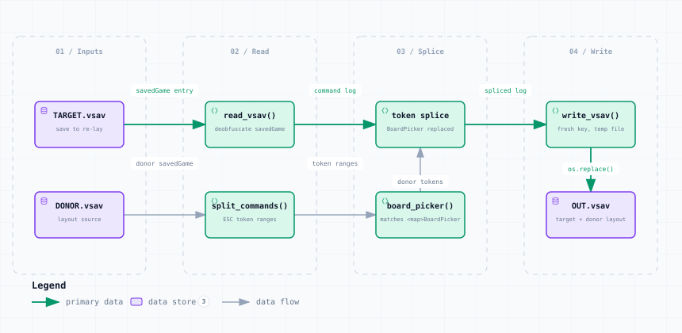

# swap_maps.py — Data Flow

<picture>
  <source media="(prefers-color-scheme: dark)" srcset="swap_maps-dark.svg">
  
</picture>

*The image above is a static export. The interactive version — pan, zoom, search, relationship tracing and its own light/dark toggle — is [`swap_maps.html`](swap_maps.html); download it and open it in a browser, no server or network needed.*

**Stages:** Inputs → Read → Splice → Write

## Elements

| Element | Kind | Note |
|---|---|---|
| **TARGET.vsav** | database | save to re-lay |
| **DONOR.vsav** | database | layout source |
| **read_vsav()** | backend | deobfuscate savedGame |
| **split_commands()** | backend | ESC token ranges |
| **token splice** | backend | BoardPicker replaced |
| **board_picker()** | backend | matches &lt;map&gt;BoardPicker |
| **write_vsav()** | backend | fresh key, temp file |
| **OUT.vsav** | database | target + donor layout |

## Flows

| From | | To | Carries |
|---|---|---|---|
| TARGET.vsav | → | read_vsav() | savedGame entry |
| read_vsav() | → | token splice | command log |
| token splice | → | write_vsav() | spliced log |
| DONOR.vsav | → | split_commands() | donor savedGame |
| split_commands() | → | board_picker() | token ranges |
| board_picker() | → | token splice | donor tokens |
| write_vsav() | → | OUT.vsav | os.replace() |

## What it shows

### What is copied

- Only the &lt;mapName&gt;BoardPicker token(s) are replaced
- Every other command token is copied byte-for-byte
- savedata and moduledata entries are copied whole

### Shared core

- read_vsav / split_commands / write_vsav live here and are imported by ten other tools
- Pass ALL instead of map names to swap every BoardPicker command

---

Source: [`swap_maps.dataflow.json`](swap_maps.dataflow.json) · rendered with the `archify` skill at its `showcase` quality profile. The SVGs beside this page are exported from that same HTML, so the three formats cannot drift — regenerate them together with [`docs/export-diagrams.py`](../../export-diagrams.py); see [`docs/diagrams.md`](../../diagrams.md).
