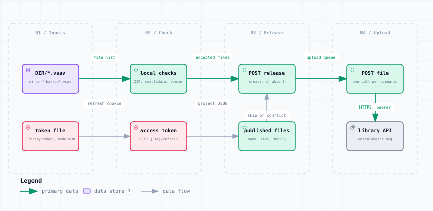

# upload_scenarios.py — Data Flow

<picture>
  <source media="(prefers-color-scheme: dark)" srcset="upload_scenarios-dark.svg">
  
</picture>

*The image above is a static export. The interactive version — pan, zoom, search, relationship tracing and its own light/dark toggle — is [`upload_scenarios.html`](upload_scenarios.html); download it and open it in a browser, no server or network needed.*

**Stages:** Inputs → Check → Release → Upload

## Elements

| Element | Kind | Note |
|---|---|---|
| **DIR/*.vsav** | database | minus *-backup*.vsav |
| **token file** | security | library-token, mode 600 |
| **local checks** | backend | ZIP, moduledata, semver |
| **access token** | security | POST {ums}/refresh |
| **POST release** | backend | created if absent |
| **published files** | backend | name, size, sha256 |
| **POST file** | backend | one call per scenario |
| **library API** | external | vassalengine.org |

## Flows

| From | | To | Carries |
|---|---|---|---|
| DIR/*.vsav | → | local checks | file list |
| local checks | → | POST release | accepted files |
| POST release | → | POST file | upload queue |
| token file | → | access token | refresh cookie |
| access token | → | published files | project JSON |
| published files | → | POST release | skip or conflict |
| POST file | → | library API | HTTPS, bearer |

## What it shows

### Every server check is made locally first

- A rejection costs the whole upload of that file, so nothing is sent that would fail
- moduledata &lt;version&gt; must be full semver and must equal the release version
- Filenames are checked against the object store rules before a byte leaves the machine

### Safe to re-run

- A file already in the release is skipped — UNIQUE(release_id, filename) on the server
- Same name but different SHA-256 is reported as a conflict, never overwritten silently
- Each upload is verified against the project JSON the service returns

---

Source: [`upload_scenarios.dataflow.json`](upload_scenarios.dataflow.json) · rendered with the `archify` skill at its `showcase` quality profile. The SVGs beside this page are exported from that same HTML, so the three formats cannot drift — regenerate them together with [`docs/export-diagrams.py`](../../export-diagrams.py); see [`docs/diagrams.md`](../../diagrams.md).
